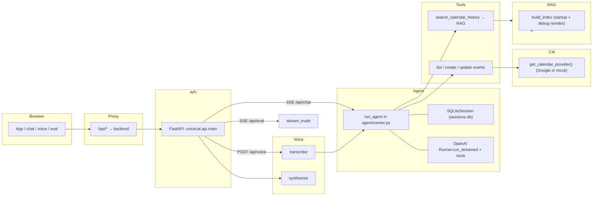
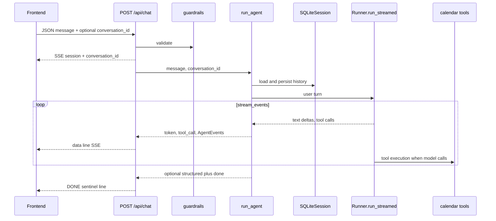
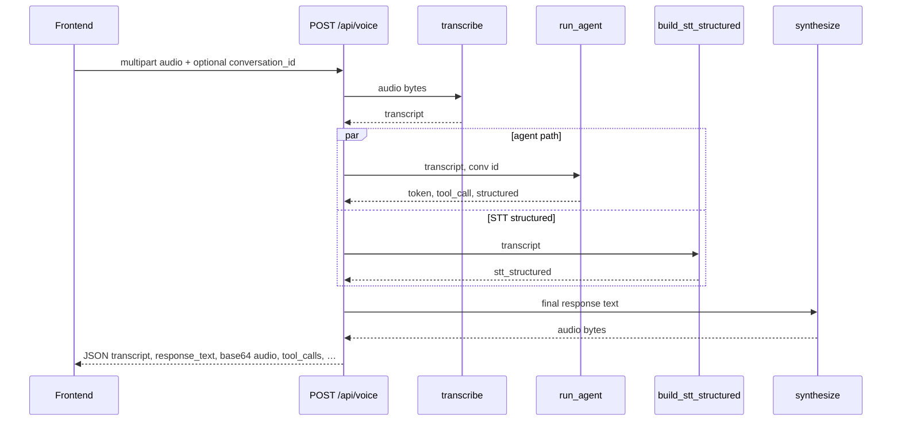
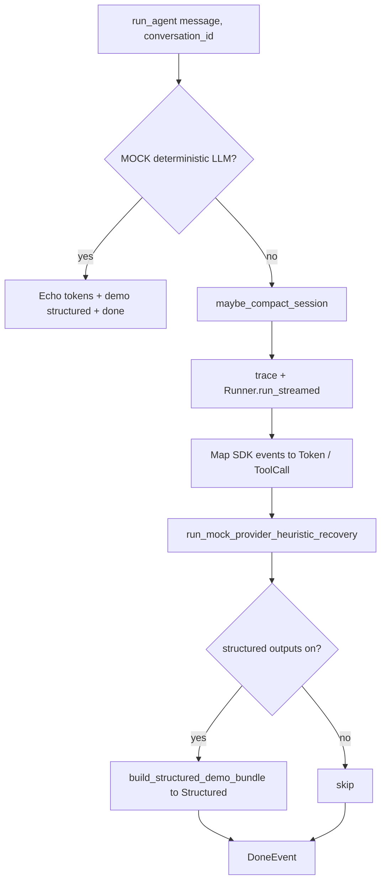

# VoiceCal Demo

VoiceCal is a demo calendar assistant that supports typed chat, voice input/output, tool-calling for calendar actions, and a live eval panel.

## Architecture

- `frontend/`: Vite + React + TypeScript SPA.
- `backend/`: FastAPI service with SSE streaming, tool orchestration, voice endpoints, and eval harness.
- `eval/golden.jsonl`: golden scenarios for deterministic-ish grading runs.

```text
Browser (React)
  ├─ POST /api/chat (SSE token + tool stream)
  ├─ POST /api/voice (audio -> STT -> agent -> TTS)
  └─ POST /api/eval (SSE eval progress)
        ↓
FastAPI (agent loop + tools + errors)
  ├─ Google Calendar tool calls
  ├─ RAG search over indexed event history
  └─ Eval harness against golden scenarios
```

### Mermaid diagrams

Render these in GitHub, VS Code, or [mermaid.live](https://mermaid.live).

#### System context



#### POST /api/chat (SSE)



#### POST /api/voice (JSON response)



#### Inside run_agent (simplified)



## Local Run

### Backend

```bash
cd backend
uv sync
cp .env.example .env
uv run uvicorn voicecal.app:app --reload --port 8000
```

### Frontend

```bash
cd frontend
pnpm install
pnpm dev
```

## Checks

```bash
cd backend
uv run ruff check .
uv run pytest
uv run python -m voicecal.eval

cd ../frontend
pnpm build
```

## Demo Flow

1. Ask: "what's on my calendar this week?"
2. Voice: "book 30 minutes with Alex Friday afternoon"
3. Reschedule: "move that to Tuesday at 10"
4. Ask: "when did I last meet with Sarah?"
5. Open eval panel and run all scenarios.
